# 🏦 Loan Approval Prediction — ML Classification Study

[](https://www.python.org/)
[](https://scikit-learn.org/)
[](https://jupyter.org/)
[](LICENSE)
[]()

> **End-to-end binary classification project** — from raw data with missing values and class imbalance to a tuned model achieving **88.89% accuracy**, covering the full ML lifecycle: EDA → Preprocessing → Feature Engineering → Modeling → Evaluation.

---

## 📌 Table of Contents

- [Problem Statement](#-problem-statement)
- [Dataset](#-dataset)
- [Project Structure](#-project-structure)
- [Exploratory Data Analysis](#-exploratory-data-analysis)
- [Preprocessing Pipeline](#-preprocessing-pipeline)
- [Models & Results](#-models--results)
- [ROC Curve Analysis](#-roc-curve-analysis)
- [Tech Stack](#-tech-stack)
- [Setup & Usage](#-setup--usage)
- [Key Learnings](#-key-learnings)

---

## 🎯 Problem Statement

Banks manually evaluate hundreds of loan applications daily — a slow, inconsistent, and bias-prone process. This project builds a **machine learning pipeline** that predicts whether a loan should be approved or rejected based on applicant demographics and financial data.

**Business goal:** Reduce manual review time and improve decision consistency by automating the first-pass evaluation with a data-driven model.

---

## 📊 Dataset

| Property | Details |
|---|---|
| Source | [Kaggle — Loan Prediction Dataset](https://www.kaggle.com/datasets/ninzaami/loan-predication) |
| Records | 614 applicants |
| Features | 11 input features + 1 target |
| Target | `Loan_Status` — Approved (Y) / Rejected (N) |
| Class distribution | ~69% Approved / 31% Rejected (imbalanced) |

### Features

| Feature | Type | Description |
|---|---|---|
| Gender | Categorical | Male / Female |
| Married | Categorical | Marital status |
| Dependents | Categorical | Number of dependents |
| Education | Categorical | Graduate / Not Graduate |
| Self_Employed | Categorical | Employment type |
| ApplicantIncome | Numerical | Monthly income |
| CoapplicantIncome | Numerical | Co-applicant income |
| LoanAmount | Numerical | Loan amount (thousands) |
| Loan_Amount_Term | Numerical | Term in months |
| Credit_History | Binary | Credit history meets guidelines |
| Property_Area | Categorical | Urban / Semiurban / Rural |

---

## 🗂 Project Structure

```
loan-approval-prediction/
│
├── 📓 notebooks/
│   └── loan_approval_prediction.ipynb   # Full analysis notebook
│
├── 🐍 src/
│   ├── preprocessing.py                 # Data cleaning & feature engineering
│   ├── models.py                        # Model training & hyperparameter tuning
│   └── utils.py                         # Evaluation metrics & plotting helpers
│
├── 📁 data/
│   └── README.md                        # How to download the dataset via Kaggle API
│
├── 📈 results/
│   ├── model_comparison.csv             # Accuracy comparison of all models
│   └── plots/                           # All EDA and model evaluation plots
│
├── requirements.txt
├── .gitignore
└── README.md
```

---

## 🔍 Exploratory Data Analysis

### Missing Values

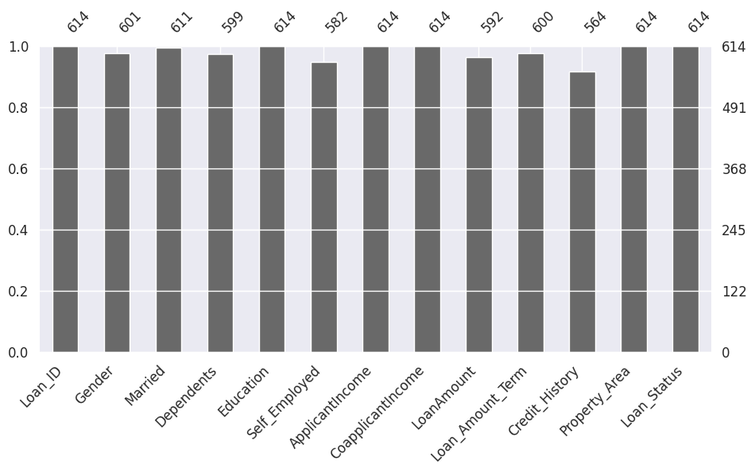

Key missing value counts — Credit_History (50), Self_Employed (32), LoanAmount (22), Dependents (15), Loan_Amount_Term (14), Gender (13), Married (3). All imputed before modeling.

### Target Distribution

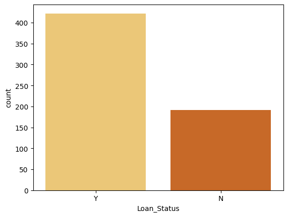

~69% of applications were approved — confirming class imbalance that must be addressed before training.

### Feature Distributions (Before Transformation)

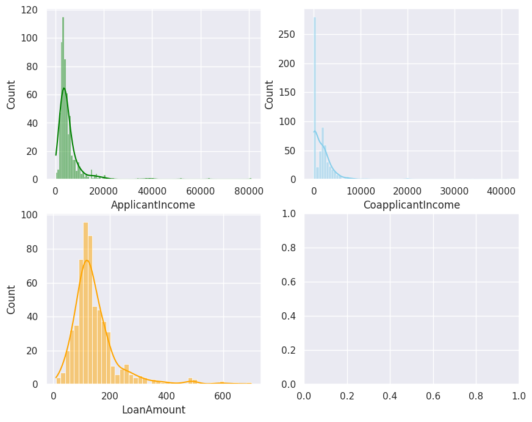
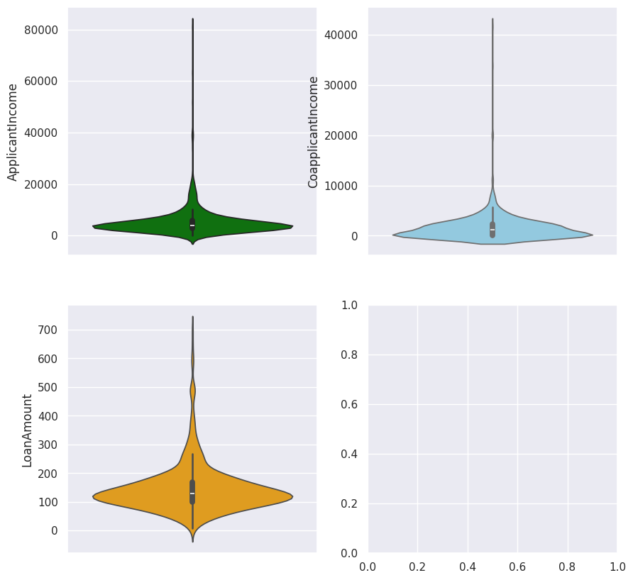

ApplicantIncome and LoanAmount show strong right-skew. Square root transformation applied to normalize.

### Correlation Heatmap

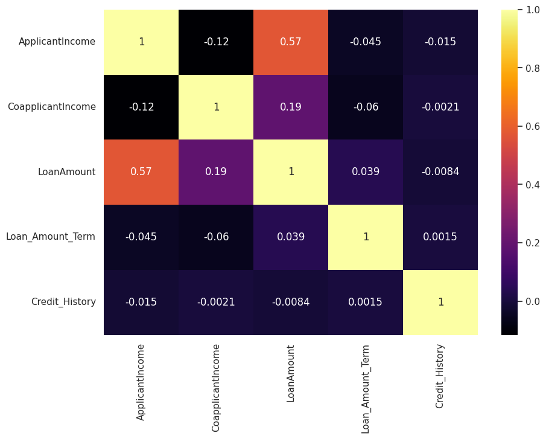

- Pearson correlation between ApplicantIncome and CoapplicantIncome: **−0.117**
- T-test p-value: **1.46e-40** — both income distributions are statistically significantly different

### Cross-tabulation Analysis

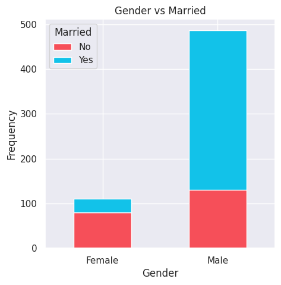
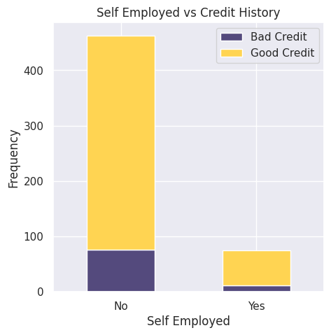
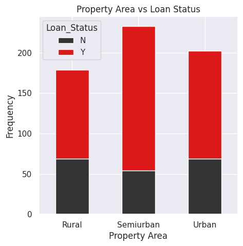

Semiurban areas show the highest loan approval rates. Good credit history is the strongest approval signal.

### Income vs Loan Amount Breakdown

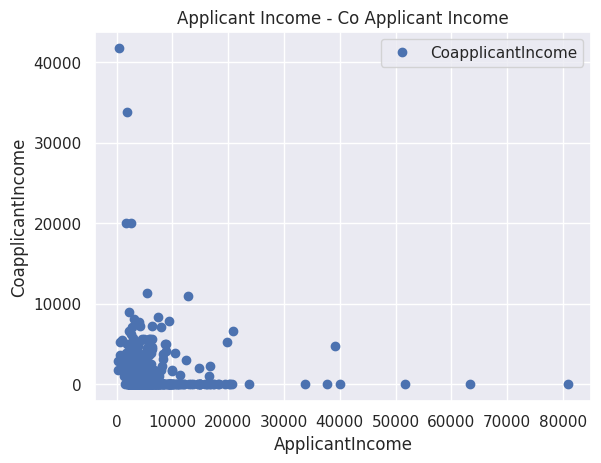
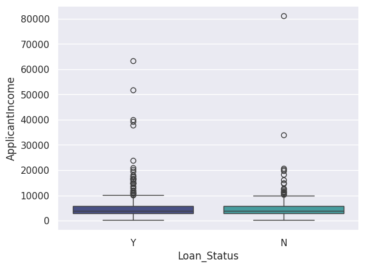
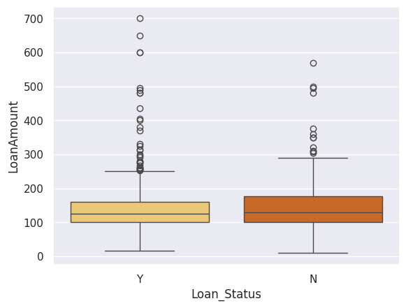

---

## ⚙️ Preprocessing Pipeline

| Step | Method | Reason |
|---|---|---|
| Drop Loan_ID | `df.drop('Loan_ID')` | Non-informative identifier |
| Impute categoricals | Mode | Preserves distribution |
| Impute LoanAmount | Mean | Appropriate for numerical |
| One-hot encoding | `pd.get_dummies()` | Numeric conversion |
| Drop redundant dummies | Remove inverse columns | Avoid dummy variable trap |
| Outlier removal | IQR method (1.5× fence) | Prevent skewed model boundaries |
| Transformation | Square root on income/loan | Reduce right-skew |
| Normalization | MinMaxScaler | Equalize feature magnitude for distance-based models |
| Class balancing | SMOTE | Fix 69/31 imbalance |

### Distributions After Square Root Transformation

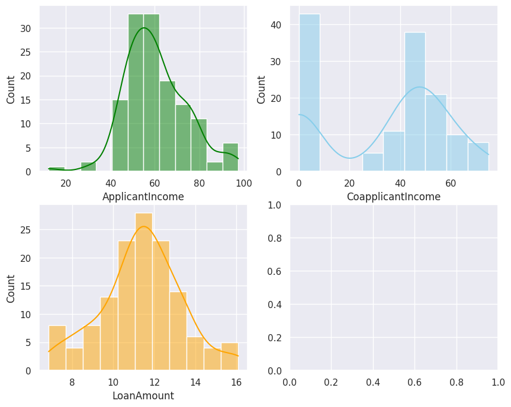

### Class Balance After SMOTE

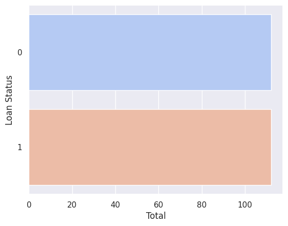

---

## 🏆 Models & Results

### Accuracy Comparison

| Rank | Model | Accuracy |
|---|---|---|
| 🥇 1 | K-Nearest Neighbors | **88.89%** |
| 🥈 2 | Random Forest | **84.44%** |
| 🥉 3 | Decision Tree | 82.22% |
| 4 | Support Vector Machine | 82.22% |
| 5 | Logistic Regression | 80.00% |
| 6 | Gradient Boosting | 77.78% |
| 7 | Categorical Naive Bayes | 75.56% |
| 8 | Gaussian Naive Bayes | 75.56% |

### KNN — k Sweep (Hyperparameter Tuning)

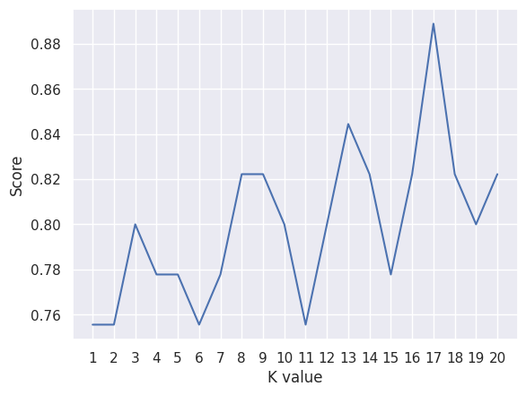

### Decision Tree — Leaf Node Sweep

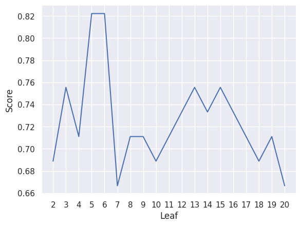

### Random Forest — Leaf Node Sweep

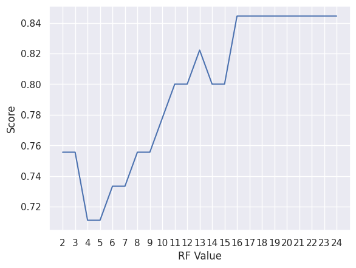

### Gradient Boosting — RandomizedSearchCV (20-fold CV)
Best parameters: `subsample=1`, `n_estimators=400`, `max_leaf_nodes=10`, `max_depth=5`

---

## 📉 ROC Curve Analysis

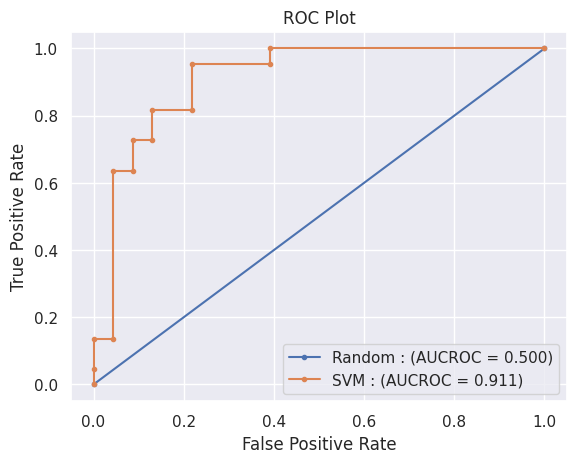

| Model | AUC-ROC |
|---|---|
| Random Baseline | 0.500 |
| **SVM (RBF kernel)** | **0.911** |

AUC-ROC of **0.911** confirms the SVM correctly discriminates between approved and rejected applicants across all classification thresholds — far beyond random chance.

---

## 🛠 Tech Stack

| Library | Purpose |
|---|---|
| `pandas`, `numpy` | Data manipulation |
| `matplotlib`, `seaborn` | Visualization |
| `scikit-learn` | ML models, preprocessing, metrics |
| `imbalanced-learn` | SMOTE class balancing |
| `missingno` | Missing value visualization |
| `scipy` | Pearson correlation, T-test |

---

## ⚙️ Setup & Usage

### 1. Clone the repo
```bash
git clone https://github.com/YOUR_USERNAME/loan-approval-prediction.git
cd loan-approval-prediction
```

### 2. Install dependencies
```bash
pip install -r requirements.txt
```

### 3. Download the dataset
Follow instructions in [`data/README.md`](data/README.md) to download via the Kaggle API.

### 4. Run the notebook
```bash
jupyter notebook notebooks/loan_approval_prediction.ipynb
```

Or open in **Google Colab** [](https://colab.research.google.com/)

---

## 💡 Key Learnings

- **SMOTE before train/test split is a data leakage pitfall** — in `src/preprocessing.py`, SMOTE is correctly applied only on the training split
- **Distance-based models** (KNN, SVM) are highly sensitive to feature scaling — MinMaxScaler was critical
- **Square root transformation** effectively reduced right-skew without losing interpretability
- **Gradient Boosting underperformed** simpler models on this small dataset — complexity ≠ accuracy
- **AUC-ROC is more reliable than accuracy** for imbalanced datasets — always report both

---

## 📄 License

MIT License — see [LICENSE](LICENSE) for details.

---

## 🙋 Author

**Mahesh Jakkala**
[](https://www.linkedin.com/in/mahesh-jakkala-6632b330b/)
[](https://github.com/MaheshJakkala)

> *Open to internship opportunities in Data Science, Machine Learning, and AI Engineering.*
